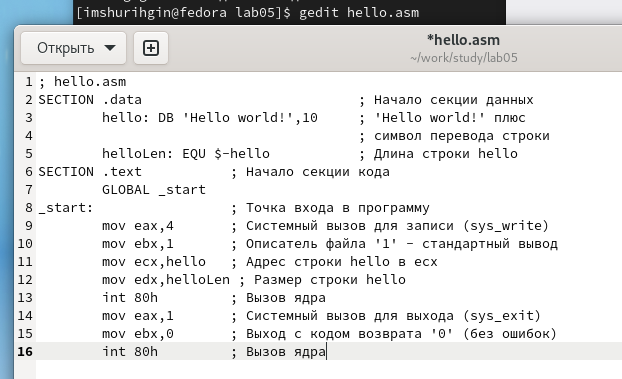

---
## Front matter
title: "ОТЧЕТ 
ПО ЛАБОРАТОРНОЙ РАБОТЕ №5"
subtitle: "дисциплина: Архитектура компьютера"
author: "Шурыгин Илья Максимович"

## Generic otions
lang: ru-RU
toc-title: "Содержание"

## Bibliography
bibliography: bib/cite.bib
csl: pandoc/csl/gost-r-7-0-5-2008-numeric.csl

## Pdf output format
toc: true # Table of contents
toc-depth: 2
lof: true # List of figures
lot: true # List of tables
fontsize: 12pt
linestretch: 1.5
papersize: a4
documentclass: scrreprt
## I18n polyglossia
polyglossia-lang:
  name: russian
  options:
	- spelling=modern
	- babelshorthands=true
polyglossia-otherlangs:
  name: english
## I18n babel
babel-lang: russian
babel-otherlangs: english
## Fonts
mainfont: PT Serif
romanfont: PT Serif
sansfont: PT Sans
monofont: PT Mono
mainfontoptions: Ligatures=TeX
romanfontoptions: Ligatures=TeX
sansfontoptions: Ligatures=TeX,Scale=MatchLowercase
monofontoptions: Scale=MatchLowercase,Scale=0.9
## Biblatex
biblatex: true
biblio-style: "gost-numeric"
biblatexoptions:
  - parentracker=true
  - backend=biber
  - hyperref=auto
  - language=auto
  - autolang=other*
  - citestyle=gost-numeric
## Pandoc-crossref LaTeX customization
figureTitle: "Рис."
tableTitle: "Таблица"
listingTitle: "Листинг"
lofTitle: "Список иллюстраций"
lotTitle: "Список таблиц"
lolTitle: "Листинги"
## Misc options
indent: true
header-includes:
  - \usepackage{indentfirst}
  - \usepackage{float} # keep figures where there are in the text
  - \floatplacement{figure}{H} # keep figures where there are in the text
---

# Цель работы

Освоить процедуру компиляции и сборки программ, написанных на ассемблере NASM.

# Задание

Необходимо создать hello.asm, оттранслировать полученный текст программы hello.asm в объектный файл, выполнить компоновку объектного файла и запустить получившийся исполняемый файл.

# Выполнение лабораторной работы

1. Создадим каталог для работы с программами на языке ассемблера NASM - lab05 и текстовый файл - hello.asm. Далее откроем файл с помощью команды gedit и введем текст.(рис. [-@fig:001])(рис. [-@fig:002])

{ #fig:001 width=70% }

{ #fig:002 width=70% }

2. Создадим объектный файл - obj.o и файл листинга - list.lst с помощью опций -o и -l соответственно.(рис. [-@fig:003])

{ #fig:003 width=70% }

3.	Создадим исполняемый файл - main из объектного файла - obj.o, из которого собран этот исполняемый файл. Далее запустим исполняемый файл с помощью команды ./main.(рис. [-@fig:004])

{ #fig:004 width=70% }

# Задание для самостоятельной работы:

1. Создадим с помощью команды cp копию файла hello.asm с именем lab5.asm и внесем изменения в текст программы в файле lab5.asm - теперь выводит фамилию и имя.(рис. [-@fig:005])

{ #fig:005 width=70% }

2.	Оттранслируем текст программы lab5.asm в объектный файл lab5.o, а затем выполним компоновку объектного файла(создадим файл - surname) и запустим получившийся исполняемый файл с помощью команды ./surname (рис. [-@fig:006])

{ #fig:006 width=70% }

3. Скопируем файлы hello.asm и lab5.asm в локальный репозиторий и загрузим их на github.(рис. [-@fig:007])

{ #fig:007 width=70% }

# Выводы

В данной лабораторной работе я научился писать простые программы на языке ассемблера NASM, а именно: созлал текстовый файл hello.asm и запустил его.
