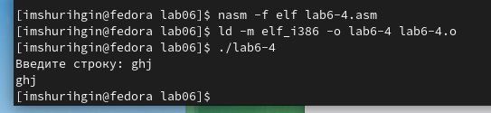

---
## Front matter
title: "ОТЧЕТ 
ПО ЛАБОРАТОРНОЙ РАБОТЕ №6"
subtitle: "дисциплина: Архитектура компьютера"
author: "Шурыгин Илья Максимович"

## Generic otions
lang: ru-RU
toc-title: "Содержание"

## Bibliography
bibliography: bib/cite.bib
csl: pandoc/csl/gost-r-7-0-5-2008-numeric.csl

## Pdf output format
toc: true # Table of contents
toc-depth: 2
lof: true # List of figures
lot: true # List of tables
fontsize: 12pt
linestretch: 1.5
papersize: a4
documentclass: scrreprt
## I18n polyglossia
polyglossia-lang:
  name: russian
  options:
	- spelling=modern
	- babelshorthands=true
polyglossia-otherlangs:
  name: english
## I18n babel
babel-lang: russian
babel-otherlangs: english
## Fonts
mainfont: PT Serif
romanfont: PT Serif
sansfont: PT Sans
monofont: PT Mono
mainfontoptions: Ligatures=TeX
romanfontoptions: Ligatures=TeX
sansfontoptions: Ligatures=TeX,Scale=MatchLowercase
monofontoptions: Scale=MatchLowercase,Scale=0.9
## Biblatex
biblatex: true
biblio-style: "gost-numeric"
biblatexoptions:
  - parentracker=true
  - backend=biber
  - hyperref=auto
  - language=auto
  - autolang=other*
  - citestyle=gost-numeric
## Pandoc-crossref LaTeX customization
figureTitle: "Рис."
tableTitle: "Таблица"
listingTitle: "Листинг"
lofTitle: "Список иллюстраций"
lotTitle: "Список таблиц"
lolTitle: "Листинги"
## Misc options
indent: true
header-includes:
  - \usepackage{indentfirst}
  - \usepackage{float} # keep figures where there are in the text
  - \floatplacement{figure}{H} # keep figures where there are in the text
---

# Цель работы

Приобрести практические навыки работы в Midnight Commander, освоить инструкции языка ассемблера mov и int.

# Задание

Необходимо написать программы, которые принимают на вход текст и выводят текст.

# Выполнение лабораторной работы

1. Откройте Midnight Commander и перейдем в каталог ~/work/study/lab05. Далее создадим папку lab06 и командой touch создадим файл lab6-1.asm.(рис. [-@fig:001])(рис. [-@fig:002])

{ #fig:001 width=70% }

{ #fig:002 width=70% }

2. Запишем в файл lab6-1.asm код программы вывода сообщения на экран и ввода строки с клавиатуры.(рис. [-@fig:003])(рис. [-@fig:004])

{ #fig:003 width=70% }

{ #fig:004 width=70% }

3. Оттранслируем текст программы lab6-1.asm в объектный файл - lab6-1.o. Выполним компоновку объектного файла и запустим получившийся исполняемый файл - lab6-1.(рис. [-@fig:005])

{ #fig:005 width=70% }

4. Скачаем файл in_out.asm.(рис. [-@fig:006])

{ #fig:006 width=70% }

5. Создадим копию файла lab6-1.asm с именем lab6-2.asm.(рис. [-@fig:007])

{ #fig:007 width=70% }

6. Изменим файл lab6-2.asm, используя подпрограммы sprintLF, sread и quit. Создадим исполняемый файл. При замене sprintLF на sprint меняется строка ввода: при sprintLF ввод с новой строки, а при sprint в той же. (рис. [-@fig:008])(рис. [-@fig:009])

{ #fig:008 width=70% }

{ #fig:009 width=70% }

# Задание для самостоятельной работы:

1. Создадим копию файла lab6-1.asm - lab6-3.asm, в котором не используем внешний файл in_out.asm. Он работает по алгоритму:
- вывести приглашение типа “Введитестроку:”;
- ввести строку с клавиатуры;
- вывести введённую строку на экран.(рис. [-@fig:010])(рис. [-@fig:011])(рис. [-@fig:012])

{ #fig:010 width=70% }

{ #fig:010 width=70% }

{ #fig:010 width=70% }

2.	Создадим копию файла lab6-2.asm - lab6-4.asm, в котором используем внешний файл in_out.asm. Он работает по алгоритму:
- вывести приглашение типа “Введитестроку:”;
- ввести строку с клавиатуры;
- вывести введённую строку на экран.(рис. [-@fig:013])(рис. [-@fig:014])(рис. [-@fig:015])

{ #fig:010 width=70% }

{ #fig:010 width=70% }

{ #fig:010 width=70% }

# Выводы

В данной лабораторной работе я научился писать простые программы на языке ассемблера NASM, а именно: создал программу вывода сообщения на экран и ввода строки с клавиатуры
