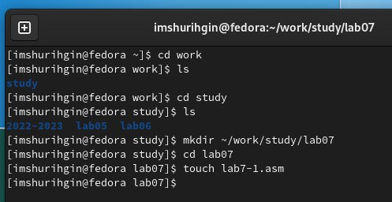
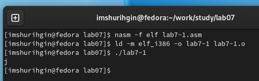
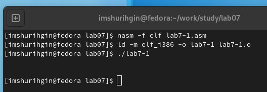
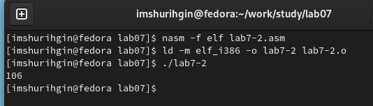
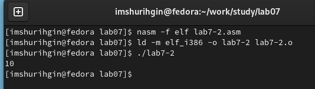
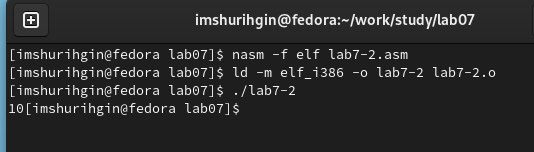
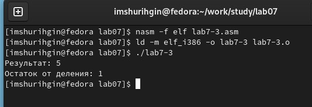
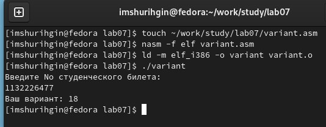
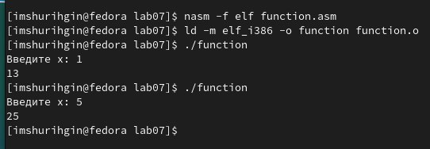
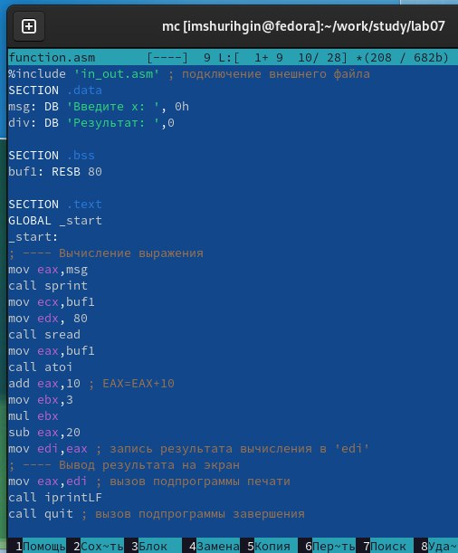

---
## Front matter
title: "ОТЧЕТ 
ПО ЛАБОРАТОРНОЙ РАБОТЕ №7"
subtitle: "дисциплина: Архитектура компьютера"
author: "Шурыгин Илья Максимович"

## Generic otions
lang: ru-RU
toc-title: "Содержание"

## Bibliography
bibliography: bib/cite.bib
csl: pandoc/csl/gost-r-7-0-5-2008-numeric.csl

## Pdf output format
toc: true # Table of contents
toc-depth: 2
lof: true # List of figures
lot: true # List of tables
fontsize: 12pt
linestretch: 1.5
papersize: a4
documentclass: scrreprt
## I18n polyglossia
polyglossia-lang:
  name: russian
  options:
	- spelling=modern
	- babelshorthands=true
polyglossia-otherlangs:
  name: english
## I18n babel
babel-lang: russian
babel-otherlangs: english
## Fonts
mainfont: PT Serif
romanfont: PT Serif
sansfont: PT Sans
monofont: PT Mono
mainfontoptions: Ligatures=TeX
romanfontoptions: Ligatures=TeX
sansfontoptions: Ligatures=TeX,Scale=MatchLowercase
monofontoptions: Scale=MatchLowercase,Scale=0.9
## Biblatex
biblatex: true
biblio-style: "gost-numeric"
biblatexoptions:
  - parentracker=true
  - backend=biber
  - hyperref=auto
  - language=auto
  - autolang=other*
  - citestyle=gost-numeric
## Pandoc-crossref LaTeX customization
figureTitle: "Рис."
tableTitle: "Таблица"
listingTitle: "Листинг"
lofTitle: "Список иллюстраций"
lotTitle: "Список таблиц"
lolTitle: "Листинги"
## Misc options
indent: true
header-includes:
  - \usepackage{indentfirst}
  - \usepackage{float} # keep figures where there are in the text
  - \floatplacement{figure}{H} # keep figures where there are in the text
---

# Цель работы

Приобрести практические навыки работы в Midnight Commander, освоить арифметические инструкциии языка ассемблера NASM.

# Задание

Необходимо написать программы, которые вычисляют функции.

# Выполнение лабораторной работы

1. Откройте Midnight Commander и перейдем в каталог ~/work/study. Создадим каталог для программам лабораторной работы N7, перейдем в него и создадим файл lab7-1.asm.(рис. [-@fig:001])

{ #fig:001 width=70% }

2. Запишем в файл lab6-1.asm код программы вывода значения регистра eax и запустим исполняемый файл. Выведется символ j, так как код символа 6 равен 00110110 в двоичном представлении(или 54 в десятичном представлении),а код символа 4 – 00110100(52), что в сумме даст 106, а это символ j по таблице ASCII.(рис. [-@fig:002])

{ #fig:002 width=70% }

3. Изменим текст программы lab7-1.asm(вместо символов, запишем в регистры числа). Программа выведет символ с кодом 10 - перенос строки.(рис. [-@fig:003])

{ #fig:003 width=70% }

4. Создадим файл lab7-2.asm, в котором используем функцию iprintLF. В результате работы программы мы получим число 106.(рис. [-@fig:004])

{ #fig:004 width=70% }

5. Изменим текст программы lab7-2.asm(изменим символы на числа). В результате работы программы мы получим число 10. Далее заменим функцию iprintLF на iprint, число 10 будет выводиться без переноса строки.(рис. [-@fig:005])(рис. [-@fig:006])

{ #fig:005 width=70% }

{ #fig:006 width=70% }

6. Создадим файл lab7-3.asm и запишем в него программу вычисления выражения 𝑓(𝑥) = (5 * 2 + 3)/3. Затем изменим текст программы так, чтобы она вычисляла выражение 𝑓(𝑥) = (4 * 6 + 2)/5.(рис. [-@fig:007])(рис. [-@fig:008])

{ #fig:007 width=70% }

{ #fig:008 width=70% }

7. Создадим программу вычисления варианта для самостоятельной работы. Создадим файл variant.asm и скопируем в нее код.(рис. [-@fig:009])

{ #fig:009 width=70% }

# Ответы на вопросы:

1. За вывод на экран сообщения ‘Ваш вариант:’ отвечают строки: 
 - mov  eax, msg
 - call sprintLF

2. Инструкция mov ecx, x используется для записывания в регистр eax запишутся данные из x. Инструкция mov edx, 80 используется для указания длины переменной х. Инструкция call sread используется для считывания введенной информации.

3. Инструкция call atoi используется для преобразования ASCII кода в число.

4. За вычисления варианта отвечают:
 - xor edx,edx
 - mov ebx,20
 - div ebx
 - inc edx

5. Остаток от деления при выполнении инструкции "div ebx" записывается в регистр edx.

6. Инструкция inc edx используется для прибавления 1.

7. За вывод на экран результата вычис-
лений отвечают:
 - mov  eax,rem
 - call sprint
 - mov  eax,edx
 - call iprintLF

# Задание для самостоятельной работы:

1. Создадим файл function.asm, который будет вычислять функцию - 3(𝑥+10)−20. Проверим работу программы на тестах: х = 1, х = 5.(рис. [-@fig:010])(рис. [-@fig:011])

{ #fig:010 width=70% }

{ #fig:011 width=70% }

# Выводы

В данной лабораторной работе я научился писать простые программы на языке ассемблера NASM, а именно: создал программу вычисления функции.
