---
## Front matter
title: "ОТЧЕТ 
ПО ЛАБОРАТОРНОЙ РАБОТЕ №8"
subtitle: "дисциплина: Архитектура компьютера"
author: "Шурыгин Илья Максимович"

## Generic otions
lang: ru-RU
toc-title: "Содержание"

## Bibliography
bibliography: bib/cite.bib
csl: pandoc/csl/gost-r-7-0-5-2008-numeric.csl

## Pdf output format
toc: true # Table of contents
toc-depth: 2
lof: true # List of figures
lot: true # List of tables
fontsize: 12pt
linestretch: 1.5
papersize: a4
documentclass: scrreprt
## I18n polyglossia
polyglossia-lang:
  name: russian
  options:
	- spelling=modern
	- babelshorthands=true
polyglossia-otherlangs:
  name: english
## I18n babel
babel-lang: russian
babel-otherlangs: english
## Fonts
mainfont: PT Serif
romanfont: PT Serif
sansfont: PT Sans
monofont: PT Mono
mainfontoptions: Ligatures=TeX
romanfontoptions: Ligatures=TeX
sansfontoptions: Ligatures=TeX,Scale=MatchLowercase
monofontoptions: Scale=MatchLowercase,Scale=0.9
## Biblatex
biblatex: true
biblio-style: "gost-numeric"
biblatexoptions:
  - parentracker=true
  - backend=biber
  - hyperref=auto
  - language=auto
  - autolang=other*
  - citestyle=gost-numeric
## Pandoc-crossref LaTeX customization
figureTitle: "Рис."
tableTitle: "Таблица"
listingTitle: "Листинг"
lofTitle: "Список иллюстраций"
lotTitle: "Список таблиц"
lolTitle: "Листинги"
## Misc options
indent: true
header-includes:
  - \usepackage{indentfirst}
  - \usepackage{float} # keep figures where there are in the text
  - \floatplacement{figure}{H} # keep figures where there are in the text
---

# Цель работы

Изучить команды условного и безусловного переходов(инструкция jmp).

# Задание

Необходимо написать программы, которые вычисляют значение функции, зависящее от вводных данных.

# Выполнение лабораторной работы

1. Откройте Midnight Commander и перейдем в каталог ~/work/study. Создадим каталог для программам лабораторной работы N8, перейдем в него и создадим файл lab8-1.asm.(рис. [-@fig:001])

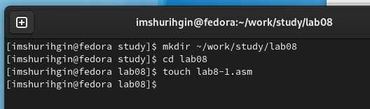{ #fig:001 width=70% }

2. Запишем в файл lab8-1.asm текст программы из листинга 8.1, она будет выводить: сообщение 2, затем - 3. Изменим текст программы на код из листинга 8.2. Теперь программа выводит: сообщение 2, затем - 1.(рис. [-@fig:002])

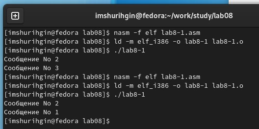{ #fig:002 width=70% }

3. Изменим текст программы lab8-1.asm так, чтобы вывод программы был следующим: сообщение 3, затем - 2, потом - 1.(рис. [-@fig:003])(рис. [-@fig:004])

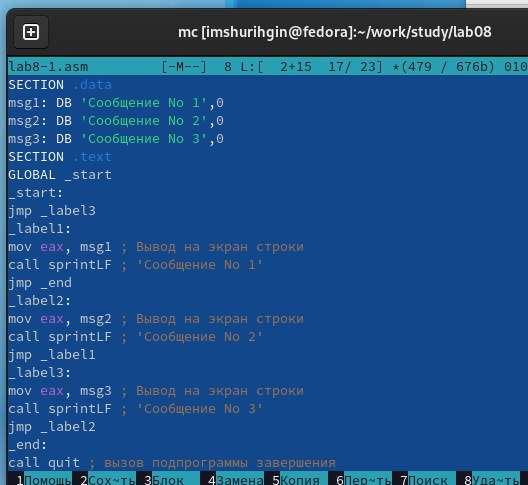{ #fig:003 width=70% }

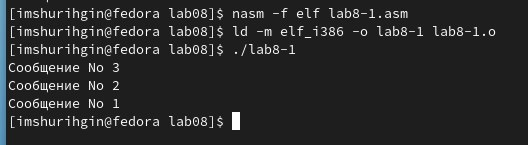{ #fig:004 width=70% }

4. Создадим файл lab8-2.asm и запишем в него код из листинга 8.3(Программа, которая определяет и выводит на экран наибольшую из 3 целочисленных переменных: A,B и C).(рис. [-@fig:005])

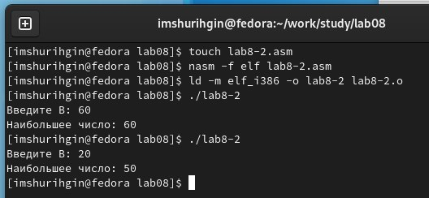{ #fig:005 width=70% }

5. Создадим файл листинга для программы из файла lab8-2.asm с помощью команды: nasm -f elf -l lab8-2.lst lab8-2.asm.(рис. [-@fig:006])

На строке 14 записан ее номер, адрес - 000000E8, машинный код - B8000000 и сама команда - mov eax,msg1, которая записывает содержимое msg1 в ячейку памяти eax.

На строке 15 записан ее номер, адрес - 000000ED, машинный код - E81DFFFFFF и сама команда - call sprint, которая выводит данные

На строке 19 записан ее номер, адрес - 000000FC, машинный код - E842FFFFFF и сама команда - call sread, которая считывает входные данные

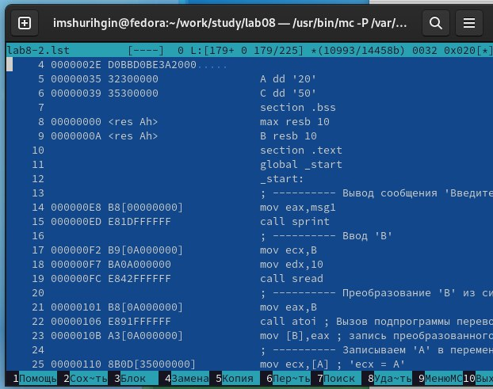{ #fig:006 width=70% }

6. В файле с программой lab8-2.asm удалим один операнд у инструкции с двумя операндами. На строке 18 удалим операнд у mov и оставим только edx. Попытаемся выполнить трансляцию с получением файла листинга.(рис. [-@fig:007])(рис. [-@fig:008])

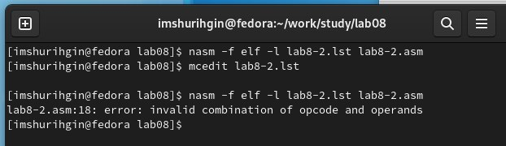{ #fig:007 width=70% }

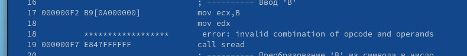{ #fig:008 width=70% }

# Задание для самостоятельной работы:

1. Напишем программу нахождения наименьшей из 3 целочисленных переменных a, b и c. Данные значения: 83,73,30.(рис. [-@fig:009])(рис. [-@fig:010])

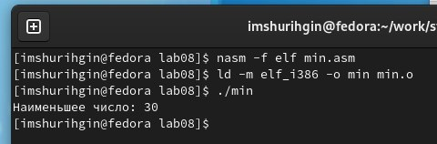{ #fig:009 width=70% }

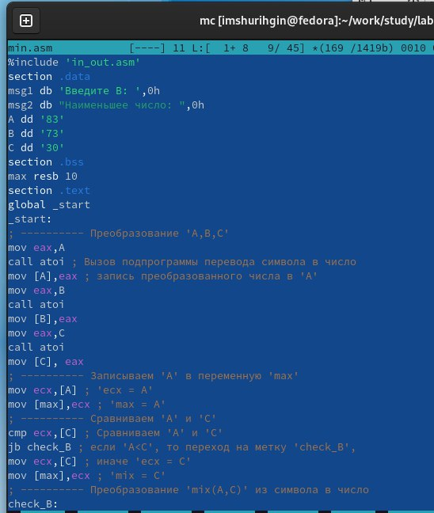{ #fig:010 width=70% }

2. Напишем программу, которая для введенных с клавиатуры значений x и a вычисляет значение заданной функции f(x) и выводит результат вычислений. Данная функция выводит a^2, a ≠ 1 и 10 + x, a = 1.(рис. [-@fig:011])(рис. [-@fig:012])

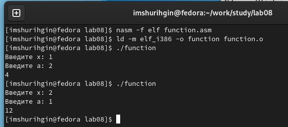{ #fig:011 width=70% }

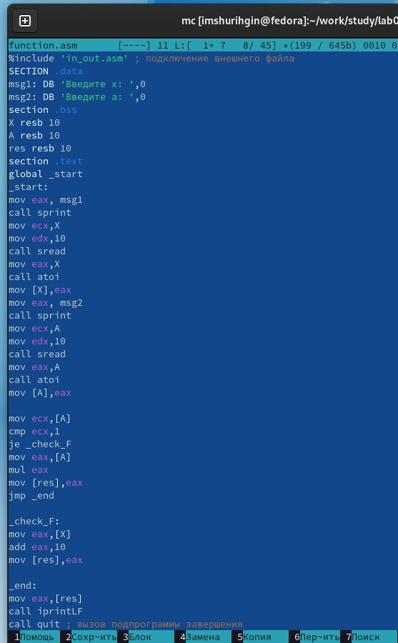{ #fig:012 width=70% }

# Выводы

В данной лабораторной работе я научился писать простые программы на языке ассемблера NASM, а именно: создал программу которая вычисляет значение функции, зависящее от вводных данных и программу нахождения наименьшей из 3 целочисленных переменных.