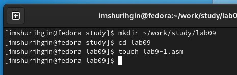
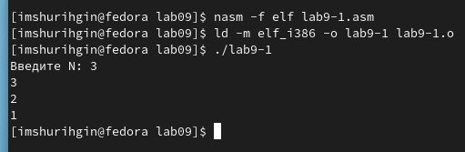
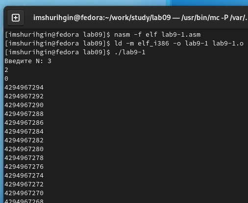
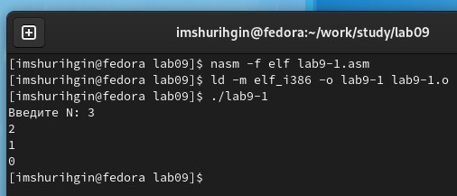
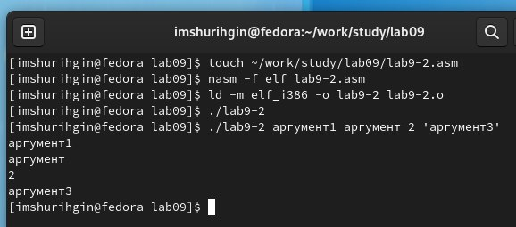
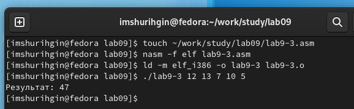
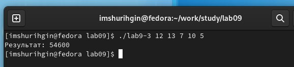
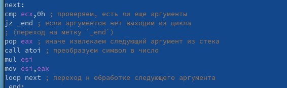
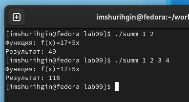
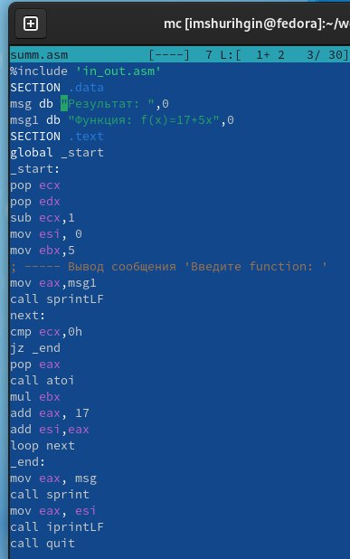

---
## Front matter
title: "ОТЧЕТ 
ПО ЛАБОРАТОРНОЙ РАБОТЕ №9"
subtitle: "дисциплина: Архитектура компьютера"
author: "Шурыгин Илья Максимович"

## Generic otions
lang: ru-RU
toc-title: "Содержание"

## Bibliography
bibliography: bib/cite.bib
csl: pandoc/csl/gost-r-7-0-5-2008-numeric.csl

## Pdf output format
toc: true # Table of contents
toc-depth: 2
lof: true # List of figures
lot: true # List of tables
fontsize: 12pt
linestretch: 1.5
papersize: a4
documentclass: scrreprt
## I18n polyglossia
polyglossia-lang:
  name: russian
  options:
	- spelling=modern
	- babelshorthands=true
polyglossia-otherlangs:
  name: english
## I18n babel
babel-lang: russian
babel-otherlangs: english
## Fonts
mainfont: PT Serif
romanfont: PT Serif
sansfont: PT Sans
monofont: PT Mono
mainfontoptions: Ligatures=TeX
romanfontoptions: Ligatures=TeX
sansfontoptions: Ligatures=TeX,Scale=MatchLowercase
monofontoptions: Scale=MatchLowercase,Scale=0.9
## Biblatex
biblatex: true
biblio-style: "gost-numeric"
biblatexoptions:
  - parentracker=true
  - backend=biber
  - hyperref=auto
  - language=auto
  - autolang=other*
  - citestyle=gost-numeric
## Pandoc-crossref LaTeX customization
figureTitle: "Рис."
tableTitle: "Таблица"
listingTitle: "Листинг"
lofTitle: "Список иллюстраций"
lotTitle: "Список таблиц"
lolTitle: "Листинги"
## Misc options
indent: true
header-includes:
  - \usepackage{indentfirst}
  - \usepackage{float} # keep figures where there are in the text
  - \floatplacement{figure}{H} # keep figures where there are in the text
---

# Цель работы

Приобрети навык написания программ с использованием циклов и обработкой аргументов командной строки.

# Задание

Необходимо написать программы, которые вычисляют значение функции, зависящее от вводных данных.

# Выполнение лабораторной работы

1. Откроием Midnight Commander и перейдем в каталог ~/work/study. Создадим каталог для программам лабораторной работы N9, перейдем в него и создадим файл lab9-1.asm.(рис. [-@fig:001])

{ #fig:001 width=70% }

2. Запишем в файл lab9-1.asm текст программы из листинга 9.1, она будет выводить: 3, 2, 1. Изменим текст программы. Теперь программа работает некорректно, она выводит: 2, 0, а дальше уходит в бесконечный цикл.(рис. [-@fig:002])(рис. [-@fig:003])

{ #fig:002 width=70% }

{ #fig:003 width=70% }

3. Изменим текст программы lab9-1.asm так, чтобы вывод программы был следующим: 2, 1, 0. В этом случае число проходов цикла соответствует значению N введенному с клавиатуры.(рис. [-@fig:004])

{ #fig:004 width=70% }

4. Создадим файл lab9-2.asm и запишем в него код из листинга 9.2(Программа, которая выводит на экран аргументы командной строки) Она выводит 4 аргумента.(рис. [-@fig:005])

{ #fig:005 width=70% }

5. Создидим файл lab9-3.asm и введем в него текст программы из листинга 9.3(Программа, которая вычисляет суммы аргументов командной строки). Изменим текст программы из листинга 9.3 для вычисления произведения аргументов командной строки.(рис. [-@fig:006])(рис. [-@fig:007])

{ #fig:006 width=70% }

{ #fig:007 width=70% }

{ #fig:008 width=70% }

# Задание для самостоятельной работы:

1. Напишем программу, которая находит сумму значений функции f(x) для x = x1, x2, ..., xn, т.е. программа должна выводить значение f(x1) + f(x2)+...+f(xn). Данная функция: 17+5x.(рис. [-@fig:009])(рис. [-@fig:010])

{ #fig:009 width=70% }

{ #fig:010 width=70% }

# Выводы

В данной лабораторной работе я научился писать простые программы на языке ассемблера NASM, а именно: создал программу которая вычисляет количество введеных аргументов и программу нахождения суммы результатов функций.