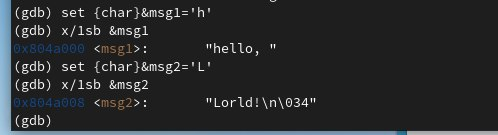

---
## Front matter
title: "ОТЧЕТ 
ПО ЛАБОРАТОРНОЙ РАБОТЕ №10"
subtitle: "дисциплина: Архитектура компьютера"
author: "Шурыгин Илья Максимович"

## Generic otions
lang: ru-RU
toc-title: "Содержание"

## Bibliography
bibliography: bib/cite.bib
csl: pandoc/csl/gost-r-7-0-5-2008-numeric.csl

## Pdf output format
toc: true # Table of contents
toc-depth: 2
lof: true # List of figures
lot: true # List of tables
fontsize: 12pt
linestretch: 1.5
papersize: a4
documentclass: scrreprt
## I18n polyglossia
polyglossia-lang:
  name: russian
  options:
	- spelling=modern
	- babelshorthands=true
polyglossia-otherlangs:
  name: english
## I18n babel
babel-lang: russian
babel-otherlangs: english
## Fonts
mainfont: PT Serif
romanfont: PT Serif
sansfont: PT Sans
monofont: PT Mono
mainfontoptions: Ligatures=TeX
romanfontoptions: Ligatures=TeX
sansfontoptions: Ligatures=TeX,Scale=MatchLowercase
monofontoptions: Scale=MatchLowercase,Scale=0.9
## Biblatex
biblatex: true
biblio-style: "gost-numeric"
biblatexoptions:
  - parentracker=true
  - backend=biber
  - hyperref=auto
  - language=auto
  - autolang=other*
  - citestyle=gost-numeric
## Pandoc-crossref LaTeX customization
figureTitle: "Рис."
tableTitle: "Таблица"
listingTitle: "Листинг"
lofTitle: "Список иллюстраций"
lotTitle: "Список таблиц"
lolTitle: "Листинги"
## Misc options
indent: true
header-includes:
  - \usepackage{indentfirst}
  - \usepackage{float} # keep figures where there are in the text
  - \floatplacement{figure}{H} # keep figures where there are in the text
---

# Цель работы

Приобрети навык написания программ с использованием подпрограмм. Познакомиться с методами отладки при помощи GDB и его основными возможностями.

# Задание

Необходимо написать программы, которые вычисляют значение функции, а затем проверить их работу в отладчике.

# Выполнение лабораторной работы

1. Откроием Midnight Commander и перейдем в каталог ~/work/study. Создадим каталог для программам лабораторной работы N10, перейдем в него и создадим файл lab10-1.asm.(рис. [-@fig:001])

{ #fig:001 width=70% }

2. Запишем в файл lab10-1.asm текст программы из листинга 10.1. Она вычисляет f(x) = 2x + 7 с помощью подпрограммы _calcul. Изменим текст программы. Теперь программа вычисляет выражение f(g(x)), где f(x) = 2x + 7, g(x) = 3x − 1.(рис. [-@fig:002])(рис. [-@fig:003])(рис. [-@fig:004])

{ #fig:002 width=70% }

{ #fig:003 width=70% }

{ #fig:004 width=70% }

3. Создим файл lab10-2.asm с текстом программы из Листинга 10.2.(Программа печати сообщения Hello world!). Для работы с GDB в исполняемый файл добавим отладочную информацию, для этого трансляцию программ необходимо проводить с ключом ‘-g’.(рис. [-@fig:005])

{ #fig:005 width=70% }

4. Запустим программу в оболочке GDB с помощью команды run.(рис. [-@fig:006])

{ #fig:006 width=70% }

5. Установим брейкпоинт на метку _start и посмотрим дисассимилированный код программы с помощью команды disassemble, начиная с метки _start.(рис. [-@fig:007])(рис. [-@fig:008])

{ #fig:007 width=70% }

{ #fig:008 width=70% }

6. Переключимся на отображение команд с Intel’овским синтаксисом, введя команду set disassembly-flavor intel.(рис. [-@fig:009])

{ #fig:009 width=70% }

7. Включим режим псевдографики для более удобного анализа программы и проверим, что была установлена точка останова(_start) с помощью команды info breakpoints.(рис. [-@fig:010])

{ #fig:010 width=70% }

8. Установим еще одну точку останова по адресу инструкции. Определим адрес предпоследней инструкции (mov ebx,0x0) и установим точку останова.
(рис. [-@fig:011])(рис. [-@fig:012])

{ #fig:011 width=70% }

{ #fig:012 width=70% }

9. Посмотрим значение переменной msg1 по имени, а значение переменной msg2 по адресу. Затем изменим первый символ переменной msg1 и любой символ во второй переменной msg2.(рис. [-@fig:013])(рис. [-@fig:014])

{ #fig:013 width=70% }

{ #fig:014 width=70% }

10. Выведем в различных форматах значение регистра edx, а затем с помощью команды set изменим значение регистра ebx. Завершим выполнение программы с помощью команды continue или stepi и выйдем из GDB с помощью команды quit.(рис. [-@fig:015])(рис. [-@fig:016])

{ #fig:015 width=70% }

{ #fig:016 width=70% }

11. Скопируем файл lab9-2.asm, созданный при выполнении лабораторной работы N9, создадим исполняемый файл и загрузим исполняемый файл в отладчик, указав аргументы.(рис. [-@fig:017])

{ #fig:017 width=70% }

12. Установим точку останова перед первой инструкцией в программе и запустим ее. Проверим число аргументов командной строки, которое распологается в регистре esp.(рис. [-@fig:018])

{ #fig:018 width=70% }

13. Посмотрим остальные позиции стека – по адесу (esp+4) располагается адрес в памяти, где находиться имя программы, по адесу (esp+8) храниться адрес первого аргумента и т.д.(рис. [-@fig:019])

{ #fig:019 width=70% }

# Задание для самостоятельной работы:

1. Преобразуем программу из лабораторной работы N9 (Задание N1 для самостоятельной работы), реализовав вычисление значения функции f(x) как подпрограмму.(рис. [-@fig:020])(рис. [-@fig:021])

{ #fig:020 width=70% }

{ #fig:021 width=70% }

2. Нужно исправить работу программы, вычисляющей выражение: (3+2)*4+5 с помощью отладчика GDB, анализируя изменения значений регистров. В отладчике видно, что программа умножает eax на 4, вместо того, чтобы умножать значение в регистре ebx, где лежит (3+2).(рис. [-@fig:022])(рис. [-@fig:023])(рис. [-@fig:024])

{ #fig:022 width=70% }

{ #fig:023 width=70% }

{ #fig:024 width=70% }

# Выводы

В данной лабораторной работе я научился писать простые программы на языке ассемблера NASM, а именно: создал программу которая вычисляет значение функции с помощью подпрограммы. А также научился находить ошибки в коде программ с помощью отладчика GDB.
